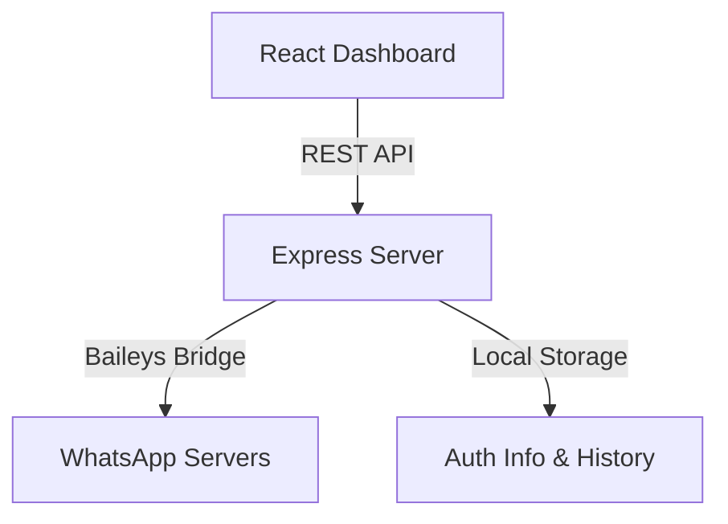

# 🚀 WhatsApp API Pro

A production-grade WhatsApp API and Management Dashboard built with **Node.js**, **TypeScript**, and **Baileys**. This project provides a robust RESTful interface for WhatsApp automation and a modern React-based frontend for monitoring and management.

---

## 🏗️ Project Architecture



### Key Components
- **Backend**: Express + TypeScript + Baileys (Protocol-based, no browser needed).
- **Frontend**: Vite + React + TypeScript + Vanilla CSS.
- **Data**: Automatic session persistence and contact syncing.

---

## ⚡ Quick Start

### 1. Installation
Clone the repository and install dependencies for both backend and frontend:

```bash
# Install Backend dependencies
npm install

# Install Frontend dependencies
cd client
npm install
cd ..
```

### 2. Running the Project

#### **Backend (API)**
Starts the server at `http://localhost:3000`.
```bash
npm run dev
```

#### **Frontend (Dashboard)**
Starts the Vite dev server at `http://localhost:5173`.
```bash
cd client
npm run dev
```

---

## 📡 API Reference

### Authentication
The API uses the `auth_info/` directory for session persistence. On first run, a QR code will appear in the terminal for linking.

| Endpoint | Method | Description |
| :--- | :--- | :--- |
| `/status` | `GET` | Check if the WhatsApp session is connected. |
| `/qr` | `GET` | Returns the current QR code image. |
| `/logout` | `POST` | Disconnect and clear session data. |

### Messaging & Contacts
| Endpoint | Method | Description |
| :--- | :--- | :--- |
| `/contacts` | `GET` | List all synced WhatsApp contacts. |
| `/messages/:phone` | `GET` | Retrieve message history for a specific contact. |
| `/send` | `POST` | Send a text message to a specific number. |
| `/bulk-send` | `POST` | Send messages to multiple numbers with a delay. |

#### **Example: Send Message**
`POST /send`
```json
{
  "phone": "91995xxxxxxx",
  "message": "Hello from WhatsApp API Pro!"
}
```

---

## 🛠️ Configuration

### TypeScript & Build
The project is configured to keep the root directory clean:
- **Source**: `server.ts`, `whatsapp.ts`.
- **Output**: All compiled files go to the `/dist` folder (ignored by Git).
- **Tooling**: Uses `tsx` for development and `tsc` for production builds.

### Git Safety
- `contacts.json` and `messages.json` are **automatically ignored** to prevent sensitive data leaks.
- `auth_info/` is ignored to protect your session credentials.

---

## 📄 License
This project is for educational purposes only. Automated use of WhatsApp is subject to their [Terms of Service](https://www.whatsapp.com/legal/terms-of-service/). Use responsibly.
